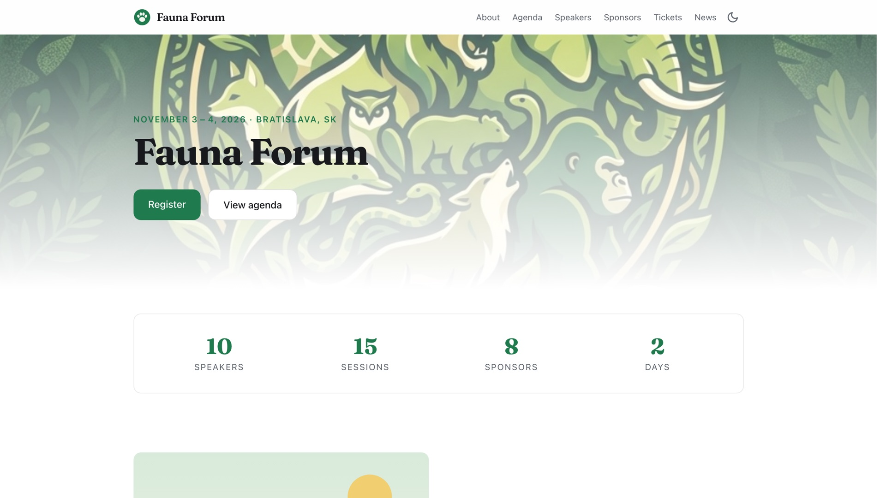
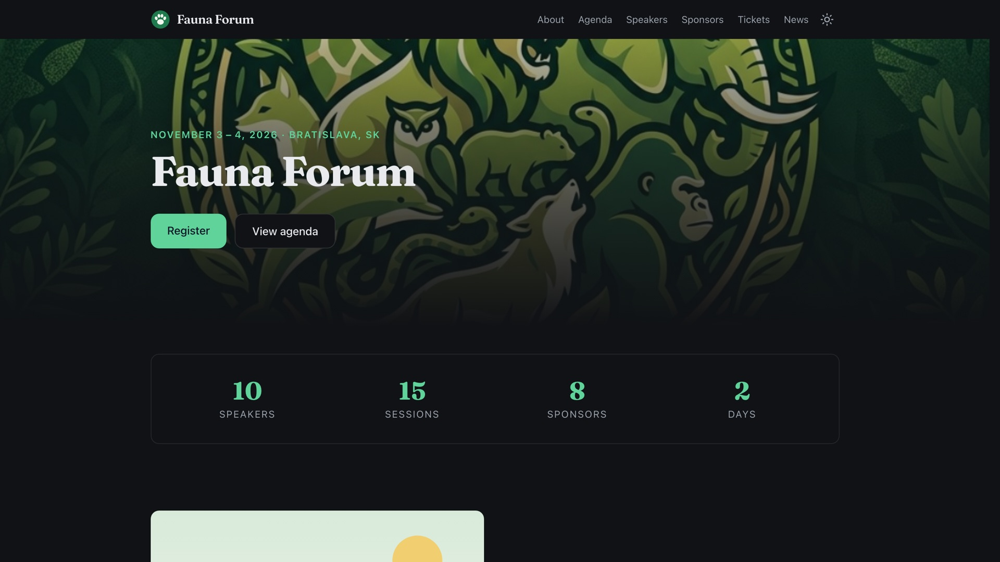

# Cloomba Conference Template

An open-source conference website template powered by the
[Cloomba](https://cloomba.com) public API. It builds a complete, fast static
site for your conference — agenda, speakers, sponsors, tickets, custom pages —
while Cloomba runs registration, paid ticketing, and check-in behind it. Your
site never touches payments or personal data.

**Live demo:** [demo.cloomba.com](https://demo.cloomba.com) — a fictional
animal conference exercising every feature: paid and hidden ticket tiers,
coupons, a multi-stage agenda with a CSS-only filter, light/dark theming, and
Event structured data.

| Light                                                                | Dark                                                    |
| -------------------------------------------------------------------- | ------------------------------------------------------- |
|  |  |

## Quick start

No account and no API key needed to try it — a fresh clone renders the demo
conference straight away:

```bash
yarn install      # run this at the REPOSITORY ROOT (yarn workspaces)
yarn dev          # → localhost:4321
yarn build        # → apps/astro-theme/dist — deploy anywhere static
```

With no key configured the build uses a shared, read-only key against the demo
event. That key's permissions cover public event content only — it cannot read
an attendee list — which is why it can sit in a public repository at all.

## Your own conference

1. Create a free key at [cloomba.com/me/developers](https://cloomba.com/me/developers)
   and choose the **Read Public** permission. Put it in
   `apps/astro-theme/.env` as `CLOOMBA_API_KEY`.
2. Point `apps/astro-theme/site.config.ts` at your event — one typed, fully
   annotated file: event slug, colors, fonts, section order, navigation.
   Validation runs at build, so a bad value fails with a readable message.

Everything event-shaped (agenda, speakers, sponsors, ticket tiers, venue) is
edited on Cloomba and picked up on the next build. Editorial content — custom
pages, FAQ, news — is markdown in `apps/astro-theme/src/content/`.

## Documentation

The demo hosts the full documentation. These pages live in this repository but
are off by default (`cloomba_docs`), so your own build doesn't publish
documentation about the template:

- [Features](https://demo.cloomba.com/cloomba-for-conferences/features)
- [Configuration](https://demo.cloomba.com/cloomba-for-conferences/configuration)
- [Customization](https://demo.cloomba.com/cloomba-for-conferences/customization)
- [Deployment](https://demo.cloomba.com/cloomba-for-conferences/deployment)

## Repository layout

```
packages/client   @cloomba/client — typed API client, generated from the live OpenAPI spec
packages/core     @cloomba/core   — site-config schema + pure domain logic (agenda, formatting, iCal)
packages/react    @cloomba/react  — thin React bindings for the live islands
apps/astro-theme  the site template: Astro (static) + React islands + Tailwind
```

`AGENTS.md` carries the working rules for contributors and AI coding agents.

## How it fits together

- **Build time:** the template pulls your event from `api.cloomba.com/public/v1`
  with a read-only key and renders static pages. The key is never shipped to the
  browser, and the one it uses by default reaches public event content only.
- **Runtime:** two small live elements (agenda now/next, ticket availability)
  poll anonymous endpoints; registration runs inside Cloomba's embedded
  widget under the attendee's own account.
- **Content:** editorial pages, FAQ, and news are markdown files in
  `apps/astro-theme/src/content/`; everything event-shaped is edited on
  Cloomba and picked up on the next build.
- **Language and wording:** every UI label the template renders lives in
  `apps/astro-theme/strings.en.json` — 81 of them. Override the ones you want
  in `apps/astro-theme/strings.ts` — it ships empty and is already wired in, so
  translating never means touching `site.config.ts`. Your entries merge over
  the English, and anything you skip stays English.

## License

[MIT](./LICENSE)
