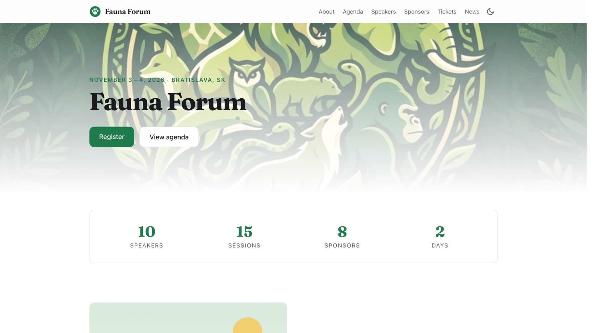
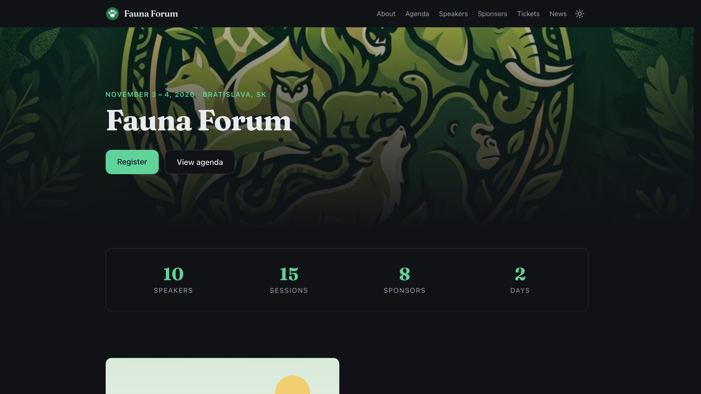

# Cloomba Conference Template

An open-source conference website template powered by the
[Cloomba](https://cloomba.com) public API. It builds a complete, fast site for
your conference — agenda, speakers, sponsors, tickets, custom pages — while
Cloomba runs registration, paid ticketing, and check-in behind it. Your site
never touches payments or personal data.

The template ships as two apps with the same design, the same configuration,
and the same pages — pick the framework you work in:

- **Astro** (`apps/astro-theme`) — a static site.
- **React on TanStack Start** (`apps/tanstack`) — server-rendered on a Node
  server, or prerendered to static files.

**Live demos:** [demo.cloomba.com](https://demo.cloomba.com) (Astro) and
[tanstack.cloomba.com](https://tanstack.cloomba.com) (TanStack Start) — a
fictional animal conference exercising every feature: paid and hidden ticket
tiers, coupons, a multi-stage agenda with a CSS-only filter, light/dark
theming, and Event structured data.

| Light                                                                | Dark                                                    |
| -------------------------------------------------------------------- | ------------------------------------------------------- |
|  |  |

## Quick start

No account and no API key needed to try it — a fresh clone renders the demo
conference straight away. Run everything at the **repository root** (yarn
workspaces):

```bash
yarn install

# Astro
yarn dev:astro              # → localhost:4321
yarn build:astro            # → apps/astro-theme/dist — deploy anywhere static

# TanStack Start
yarn dev:tanstack           # → localhost:4322
yarn build:tanstack         # Node server → yarn start:tanstack
yarn build:tanstack:static  # → apps/tanstack/.output/public — deploy anywhere static
```

With no key configured the build uses a shared, read-only key against the demo
event. That key's permissions cover public event content only — it cannot read
an attendee list — which is why it can sit in a public repository at all.

## Your own conference

1. Create a free key at [cloomba.com/me/developers](https://cloomba.com/me/developers)
   and choose the **Read Public** permission. Put it in the app's `.env`
   (`apps/astro-theme/.env` or `apps/tanstack/.env`) as `CLOOMBA_API_KEY`.
2. Point the app's `site.config.ts` at your event — one typed, fully annotated
   file: event slug, colors, fonts, section order, navigation. Validation runs
   at build, so a bad value fails with a readable message.

Everything event-shaped (agenda, speakers, sponsors, ticket tiers, venue) is
edited on Cloomba — picked up on the next build, or within a minute by the
TanStack app on a Node server. Editorial content — custom pages, FAQ, news — is
markdown in the app's `src/content/`.

Each app is self-contained: keep the one you use and delete the other.

## Documentation

The demo hosts the full documentation. These pages live in this repository but
are off by default (`cloomba_docs`), so your own build doesn't publish
documentation about the template:

- [Features](https://demo.cloomba.com/cloomba-for-conferences/features)
- [Configuration](https://demo.cloomba.com/cloomba-for-conferences/configuration)
- [Customization](https://demo.cloomba.com/cloomba-for-conferences/customization)
- [Deployment](https://demo.cloomba.com/cloomba-for-conferences/deployment)

## Repository layout

```
packages/client   @cloomba/client — typed API client, generated from the live OpenAPI spec
packages/core     @cloomba/core   — site-config + content schemas, pure domain logic (agenda, formatting, iCal)
packages/react    @cloomba/react  — thin React bindings for the live parts
apps/astro-theme  the template in Astro (static) + React islands + Tailwind
apps/tanstack     the template in React on TanStack Start (SSR or static) + Tailwind
```

`AGENTS.md` carries the working rules for contributors and AI coding agents.

## How it fits together

- **Data:** the template reads your event from `api.cloomba.com/public/v1`
  with a read-only key — at build time (Astro, TanStack static) or on the
  server (TanStack on Node, cached for a minute). The key never reaches the
  browser, and the one it uses by default reaches public event content only.
- **Static TanStack output** is served from the root of a domain or subdomain:
  pages load their data from absolute paths.
- **Live parts:** two small live elements (agenda now/next, ticket
  availability) poll anonymous endpoints; registration runs inside Cloomba's
  embedded widget under the attendee's own account.
- **Content:** editorial pages, FAQ, and news are markdown files in the app's
  `src/content/`; everything event-shaped is edited on Cloomba.
- **Language and wording:** every UI label the template renders lives in the
  app's `strings.en.json` — 83 of them. Override the ones you want in the app's
  `strings.ts` — it ships empty and is already wired in, so translating never
  means touching `site.config.ts`. Your entries merge over the English, and
  anything you skip stays English.

## License

[MIT](./LICENSE)
